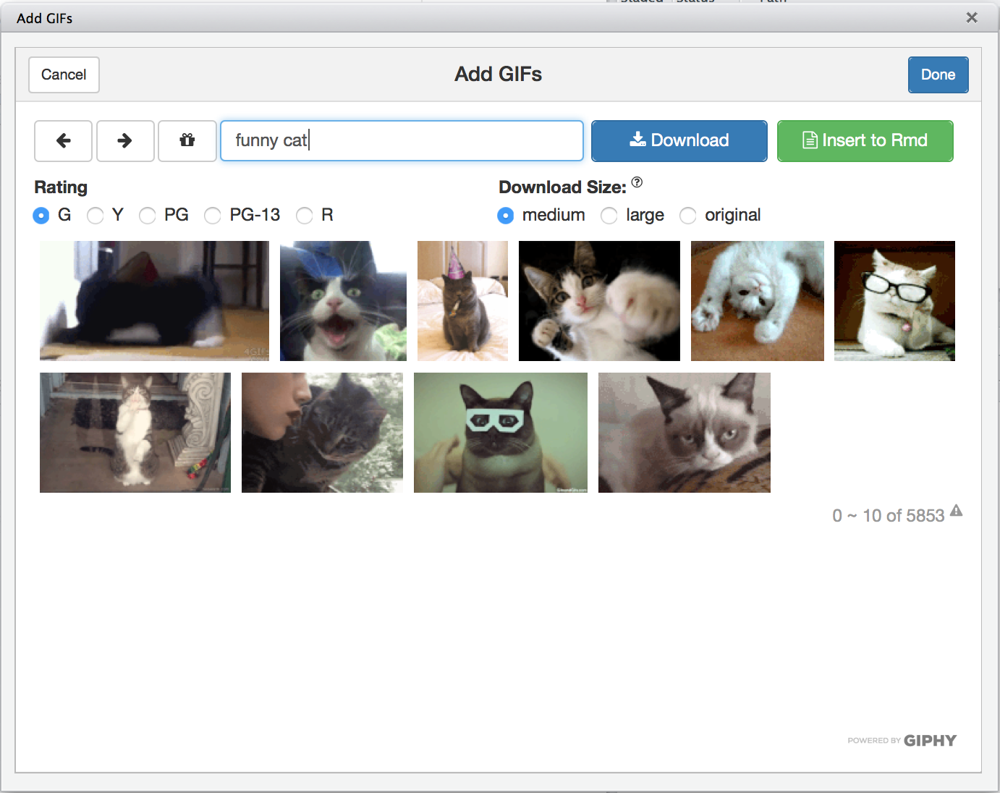

# giphyr
Want to add some GIFs to your awesome rmarkdown presentation?


## Introduction
I guess this is one of the least productive R packages in our community...

No more to say. Enjoy more GIFs in your Rmarkdown documents. 



```r
devtools::install_github("haozhu233/giphyr")
```

## Note
I'm currently using the public beta key for the Giphy API. They say there is a rate limit. I will request a Production key if needed. 
